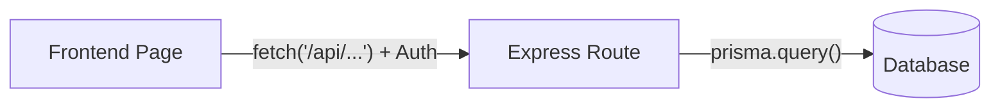
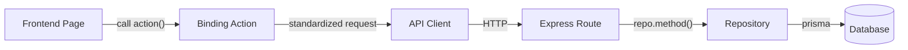

# Technical Design Report: Binding Layer Architectural Transformation

## Executive Summary
This report details the architectural evolution of the Course Platform from a **Direct Logic (Coupled)** model to a modern **Binding Layer (Decoupled)** architecture. The primary objective of this refactoring was to separate business logic from infrastructure, improving maintainability, testability, and scalability.

---

## 1. Legacy Architecture: The "Direct Logic" Model (Before)

In the legacy implementation, the system relied on tight coupling between the user interface (Frontend) and the data persistence layer (Backend).

### Frontend: Manual Fetch Management
- **Pattern:** Components were responsible for their own data fetching using raw `fetch` calls.
- **Example:** `CoursePlayerPage.tsx` manually constructed URLs using `buildApiUrl` and managed authorization headers for every request.
- **Structure:** 
    - Replicated error handling and JSON parsing logic across multiple pages.
    - Lack of unified state management for data fetching.
- **Issues:** High code duplication; changes to API signatures required updates in every component; difficult to mock for unit testing.

### Backend: Monolithic Route Handlers
- **Pattern:** Business and data-access logic were embedded directly within Express route handlers.
- **Example:** `lessons.ts` routes contained direct `prisma` calls, complex fuzzy-matching resolution logic, and data transformation helpers.
- **Structure:** 
    - Heavy route files (often exceeding 600 lines).
    - Hardcoded database queries mixed with HTTP request/response logic.
- **Issues:** Business logic was not reusable; testing required an active database connection; high risk of regressions during minor schema changes.

---

## 2. New Architecture: The "Binding Layer" Design (After)

The new architecture introduces a formal **Binding Layer** that acts as a bridge between high-level application logic and low-level data access.

### 2.1 Frontend Binding: The Action-Service Pattern
We introduced a centralized `src/lib/binding` layer to standardize all communication.

- **Centralized API Client:** The `APIClient` in `client.ts` centralizes session management, authorization headers, and unified error handling.
- **Domain Actions:** Specialized action files (e.g., `courseActions.ts`, `lessonActions.ts`) expose clean, asynchronous functions.
- **Impact:** Components now consume "Actions" (e.g., `fetchCourseTopics(id)`) instead of raw endpoints. This makes the UI completely agnostic of backend internal structures.

### 2.2 Backend Binding: The Repository Pattern
We decoupled database interactions from the API layer using strict abstractions.

- **Interface Definition (`/interfaces`):** Establishes the contract for data operations (e.g., `ICourseRepository`). This enables mocking for logic testing.
- **Implementation Layer (`/implementations`):** Encapsulates all Prisma ORM queries and logic resolution (e.g., `CourseRepository`).
- **Gateways:** External services (like OpenAI or Google Auth) are abstracted behind Gateway classes, allowing them to be swapped or updated without affecting core logic.

---

## 3. Side-by-Side Comparison

| Feature | Legacy (Old Code) | Binding Layer (New Code) |
| :--- | :--- | :--- |
| **Data Fetching** | Direct `fetch` in UI components | Specialized "Action" functions |
| **Auth Handling** | Manual header injection per call | Transparently managed by `APIClient` |
| **Logic Location** | Mixed in Route Handlers | Encapsulated in `Repositories` |
| **Code Structure** | Massive, tightly-coupled files | Lean, modular components |
| **Testability** | Hard (Requires E2E) | High (Supports unit/mock testing) |

---

## 4. Architectural Flow (Visualized)

### Legacy Flow

### Binding Layer Flow

---

## 5. Summary of Technical Impacts
*   **Decoupling:** Standardized contracts between Frontend and Backend reduce the impact of breaking changes.
*   **Reusability:** Repository methods can be reused across different routes (e.g., admin vs. student dashboards).
*   **Security:** Centralized API client ensures all requests follow the same security protocols.
*   **Maintainability:** Easier for new developers to understand the flow by following the established layers.

This architectural shift ensures that the Ottolearn Course Platform is built for long-term stability and rapid future feature development.
